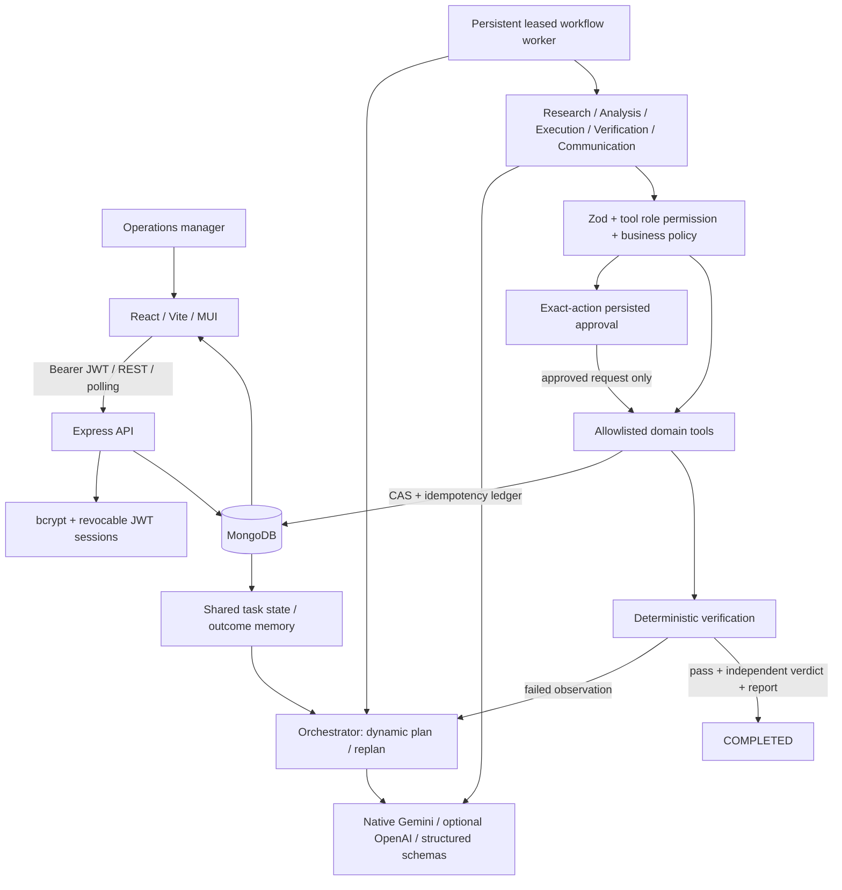

# StockPilot architecture

## Boundaries
The model proposes JSON. It cannot execute code, query arbitrary collections, select an arbitrary URL, or change policy. Task order scope/budget/deadline come from validated user inputs. Supplier descriptions, user goal, memory and tool results are untrusted data. Trusted instructions and role permissions are separate system messages.

`ai/factory.js` selects Gemini or OpenAI from trusted backend configuration. Gemini uses the official `@google/genai` SDK and `responseJsonSchema`; unsupported schema keywords are projected out of the provider format while the full Zod schema is still enforced locally. Specialist prompts include the actual allowed tool input/output schemas. Memory references are constrained to scoped stored IDs. Verification receives explicit UTC start/deadline timestamps and calculated checks; it cannot invent a stricter deadline or physical-delivery requirement.

## Persistence
Tasks embed bounded subtasks, completed steps, active step, plan revisions, observations, errors and final result. Indexed execution/event/approval/memory collections preserve detailed evidence. BusinessState uses a versioned compare-and-swap update to atomically mutate related inventory/order/purchase entries and append an idempotency receipt. Action IDs derive from task + revision + step, preventing replay after a crash. Every query carries userId.

## State lifecycle
CREATED → PLANNING → PLANNED → EXECUTING → WAITING_FOR_TOOL → EXECUTING; purchase policy may route to WAITING_FOR_APPROVAL. VERIFYING → EXECUTING (report) → COMPLETED. Failures use ANALYZING_FAILURE → RETRYING or REPLANNING. Exhausted budgets → ESCALATED. Cancellation is terminal and checked again before side effects. Restart recovers runnable tasks through an expiring worker lease. Approvals and terminal tasks do not run.

## Deployment
Static frontend on Vercel; API/worker together on Render; MongoDB Atlas. Production requires JWT_SECRET, MONGODB_URI, the selected provider's GEMINI_API_KEY or OPENAI_API_KEY, and a single explicit HTTPS FRONTEND_URL. Health distinguishes liveness/readiness/configuration. Lease renewal guards process concurrency; use one instance for the submitted MVP. No external emails/payments or purchase orders sent to real suppliers: purchasing is a genuine mutation of the application's sandbox business ledger, disclosed in UI/docs.
